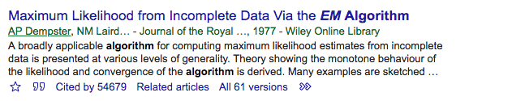

```{r setup, include=FALSE}
knitr::opts_chunk$set(echo = TRUE)
```

## Remember

Generative process $\ne$ inference algorithm
    
- Examples from the course so far?


## Today

EM

- What do we remember about the EM algorithm?


## You could say its popular




## EM Algorithm

So far, we've thought about EM strictly in the sense of clustering

- i.e., Normal mixture case
    - iteratively impute "missing/latent" group labels $Z$, update $\mu$ and $\sigma^2$


This is a specific application of EM


## EM Algorithm 

More generally,

- EM is useful when there's a sense of "missing/latent" data (real or not)

- and if that data were available, estimation (MLE) of parameters would be trivial

- So the idea of EM is to *iteratively impute the missing data* in order to estimate our parameters


## Normal mixture case again

Suppose $X = (X_1, ..., X_n)$ is iid samples from mixture

$$\pi N(\mu_1, 1) + (1- \pi)N(\mu_2, 1)$$

So, $\theta = (\pi, \mu_1, \mu_2, 1, 1)$ are our parameters we need to estimate

Consider $Z = (Z_1, ..., Z_n)$ as "missing" group labels,

$$Z_i = \begin{cases} 1 \text{ if } X_i \sim N(\mu_1, 1) \\ 0 \text{ if } X_i \sim N(\mu_2, 1) \end{cases}$$


*If we knew $Z$ estimating $\mu_1$ and $\mu_2$ is trivial.*


## One last time

Before we move on, is this all super intuitive?

1. Set initial values for $\theta$

2. E-step: **expectation**, impute "missing" values, update $Z$

3. M-step: **maximization**, estimate unknown parameters given data imputed in e-step, update $\theta$

4. Repeat 2 and 3 until convergence 


## Probit and homework

In this problem, we will derive the EM algorithm for the Probit model and
implement it `R`. Consider that the Probit model can be expressed with a
latent variable $Y_i^{*}$, which is considered to be missing. Let

\begin{align*}
Y_i & =  \left\{ \begin{array}{cc}
1 & {\rm if} \ Y_i^\ast > 0 \\
0 & {\rm if} \  Y_i^\ast \leq 0\\
\end{array} \right\} \\
Y_i^\ast & = X_i^T \beta + \epsilon_i \quad {\rm where} \quad \mathbb{E}(\epsilon_i)=0
\end{align*}


What makes it a Probit model is that we assume $\epsilon_i \overset{iid}{\sim} \mathcal{N}(0,1)$.


*How does EM apply here?  In words, what do we want the E and M steps to do?*

## Our context

Observed data $Y_i$ (usually denoted X)

Missing data $Y_i^\ast$ (usually denoted Z)

Complete data $C_i = (Y_i, Y_i^\ast)$ (usually denoted Y)

Parameters $\hat{\beta}$ (usually denoted $\theta$)

Complete likelihood $L_C(\beta)$
    - joint distribution of $Y_i$ an $Y_i^\ast$
    


## E-step

Since we don't have $y_i^\ast$'s, we need to take our current guess $\hat{\beta}$ and impute the value of $y_i^\ast$.  How?


## M-step

Now we need to take our current $y_i^\ast$ and estimate $\hat{\beta}^{new}$.

Utilize complete data likelihood.

Find

$$E_{\beta}[ log L_C (\beta') | Y]$$

Then maximize to get $\hat{\beta}^{new}$.


## Not enough time today...

Note that we haen't gone over any rigorous definition or actual derivation of the EM algorithm

If you read up on it, you'll see terms like "complete data likelihood," "observed data likelihood," "the Q function," etc.

But, the intuition is hopefully there!


